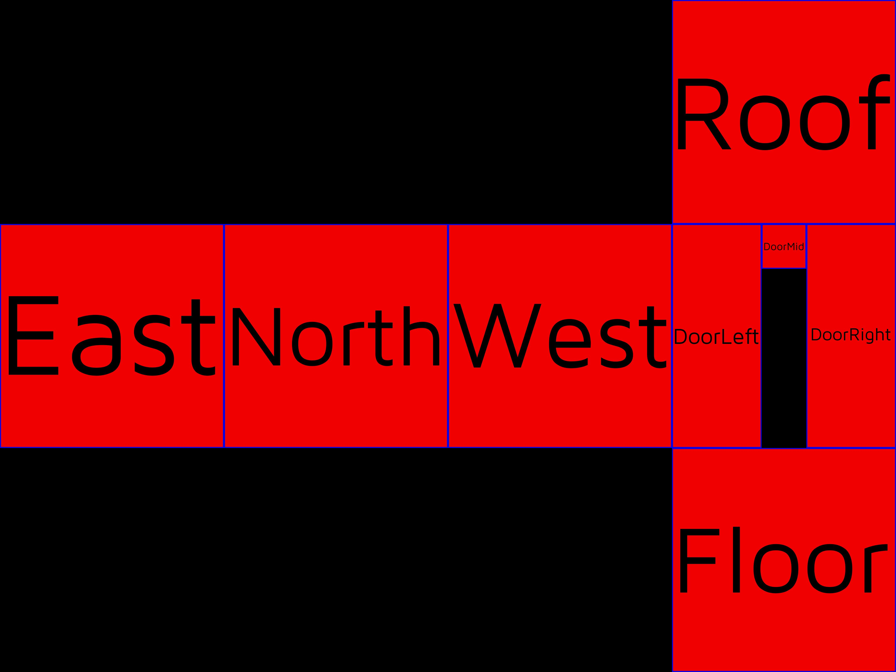

# TSG core

tsg-core contains all the engine and core functionality for running openTSG.

see the documentation for every section here:

- [Canvaswidget](_docs/canvaswidget/doc.md)
- [Colour](_docs/colour/doc.md)
- [Core](_docs/core/doc.md)
- [Credentials](_docs/credentials/doc.md)
- [ErrHandle](_docs/errHandle/doc.md)
- [Gridgen](_docs/gridgen/doc.md)
- [Middleware](_docs/middleware/doc.md)
- [tsg](_docs/tsg/doc.md)
- [widgethandler](_docs/widgethandler/doc.md)

## Test Signal Input Geometry (TSIG)

A TSIG file is used to generate images for non flat screens. e.g. a sphere or a cube

It works by mapping the geometry to a flat layout of the object, which forms the
base test pattern image all the test pattern widgets are drawn to. Keeping the same
coordinate system OpenTSG normally uses.

For example this house.

e.g. would be unwrapped as a [TSIG](./gridgen/testdata/tpig/house.json) into this flat shape.

OpenTSG would then produce a test pattern (e.g. EBU 3373) that looks like:

Which then wraps round the house like so.

Each TSIG generates specifies the size of an image, so a TSIG will not
generate an image for 6 sizes of cubes, just the image for the one cube it represents.

To see TSIGs being put into action in OpenTSG check out this [walkthrough](https://github.com/mrmxf/opentsg-node/blob/main/READMETPIG.md)
and generate these images yourself.
Or check the [Gridgen](_docs/gridgen/doc.md) docs to find more about how TSIGs work.
