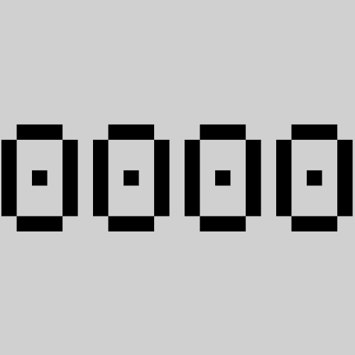
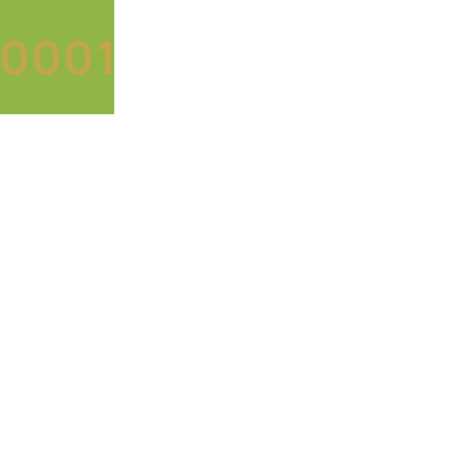
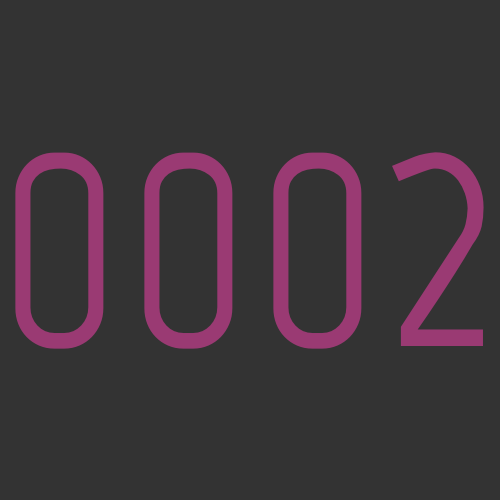

# framecount

Produces a four number long frame number, for
where the test card is in a sequence of patterns.

It has the following required properties.

- `frameCounter` - if true then the frame counter will be used. If false then
the widget is skipped.

And the following optional properties:

- `font` - the font to be used, it can be an in built font of title, body,
pixel or header. Or it can be the path to a local or web file.
- `textColor` - the colour of the text.
- `backgroundColor` - the colour of the background.
- `fontSize` - the font size of the frame counter,
this dictates the size of the frame counter box
- `gridPosition` - the relative x,y positions as percentages
of the grid the inhabit. There are also the builtin positions of
`"bottom right"`, `"bottom left"`,`"top right"` or `"top left"`.

```json
{
    "type" :  "builtin.framecounter",
    "frameCounter": true,
    "textColor": "",
    "backgroundColor": "",
    "font": "",
    "fontSize": 22, 
    "gridPosition": "top left",
    "grid": {
      "location": "a1",
      "alias" : "A demo Alias"
    }
}
```

Here are some further examples and their output:

- [minimum.json](../../exampleJson/builtin.frameCounter/minimum-example.json)



- [maximum.json](../../exampleJson/builtin.frameCounter/maximum-example.json)



- [styleChange.json](../../exampleJson/builtin.frameCounter/styleChange-example.json)


