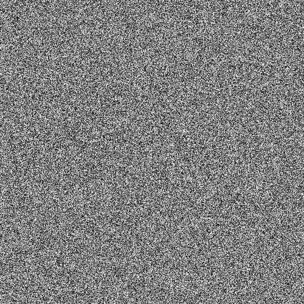

# Noise

Noise generates 12 bit white noise to fill the widget.

It has the following required fields:

- `noiseType` - the type of noise to be generated. Only 
`"white noise"` is an accepted input.

It has the following optional fields

- `minimum` - the minimum 12 bit integer value for the white noise
- `maximum` - the maximum 12 bit integer value for the white noise

```json
{
    "type" :  "builtin.noise",
    "noiseType": "white noise",
    "minimum": 0,
    "maximum": 4095,
    "grid": {
      "location": "a1",
      "alias" : "A demo Alias"
    }
}
```

- [minimum.json](../../exampleJson/builtin.noise/minimum-example.json)



- [maximum.json](../../exampleJson/builtin.noise/maximum-example.json)


