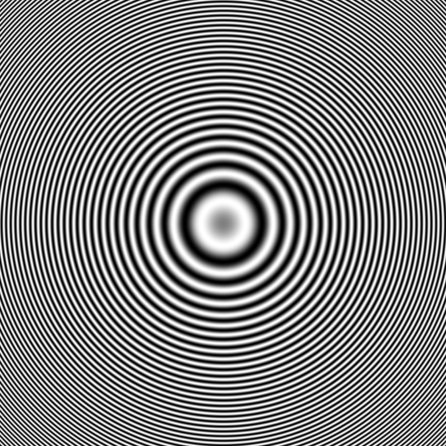
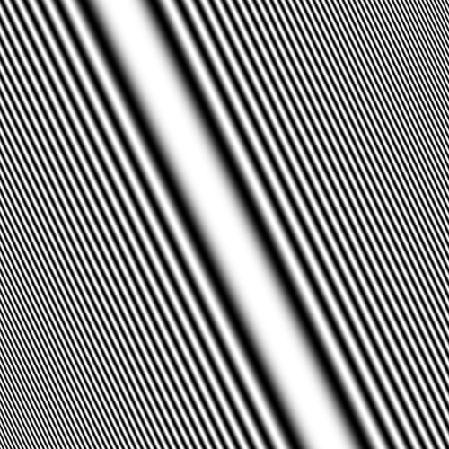
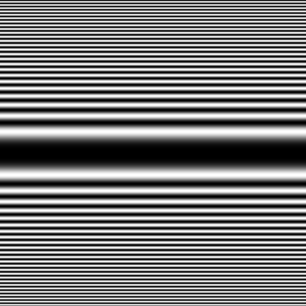

# Zoneplate

Generates a zoneplate to fill the given area.

It has the following required fields:

- `plateType` - the type and shape of zone plate these are `circular`, `sweep` or `ellipse`.
The default option is `circular`.

It has the following optional fields:

- `startColor` -  the start colour of the zone plate, these are `white`, `black`, `grey` or `gray`.
- `angle` - the angle for the zone plate to be to rotated, fits the following patterns
`^π\\*(\\d){1,4}$`, `^π\\*(\\d){1,4}/{1}(\\d){1,4}$` or a number between 0 and 360

```json
{
    "type" :  "builtin.zoneplate",
    "plateType": "sweep",
    "startColor": "white",
    "angle": "π*1",
    "grid": {
      "location": "a1",
      "alias" : "A demo Alias"
    }
}
```

Here are some further examples and their output:

- [minimum.json](../../exampleJson/builtin.zoneplate/minimum-example.json) This does



- [maximum.json](../../exampleJson/builtin.zoneplate/maximum-example.json)



- [norotation.json](../../exampleJson/builtin.zoneplate/noangle-example.json)


