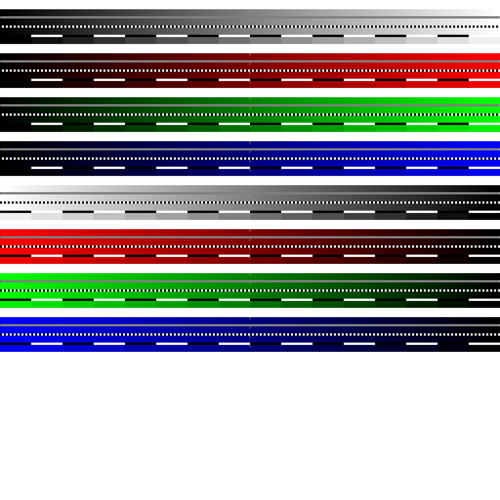
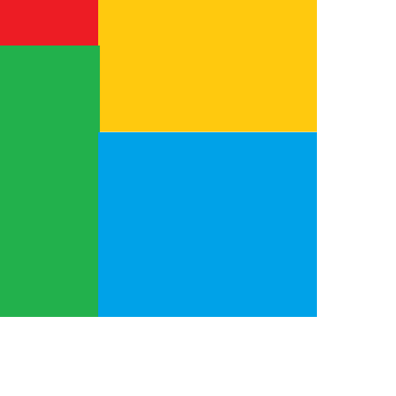

# Add Image

Add image adds an image onto the test pattern.

It has the following required fields:

- `image` - the local or online location of image to be added.

And the following optional fields:

- `imageFill` - the fill type of the image, which are:
  - `fill` - Stretch the image to fill the X and Y axis. This is the default option
  - `x scale` - Scale the image to fit the X axis
  - `y scale` - Scale the image to fit the Y axis
  - `xy scale` -  Scale the image to fit the X or Y axis, which ever one is reached first.
  - `preserve`- The image is not scaled and the original dimensions are preserved. This is centred
  around the widget centre.
- `offset`- the offset of the image placement.
All values follow the [offset unit rules](../utils/parameters/readme.md#offset)
It has the following fields:
  - `x` - The x offset of the image, measured from the left of the image.
  - `y` - The Y offset of the image, measured from the top of the image

```json
{
    "type" :  "builtin.addimage",
    "image": "./exmaple/exampleImage.png",
    "imageFill": "fill",
    "grid": {
      "location": "a1",
      "alias" : "A demo Alias"
    },
    "offset":{
      "x":20,
      "y":"20px"
    }
}
```

Here are some further examples and their output:

- [Minium.json](../exampleJson/builtin.addimage/minimum-example.json)



- [Maximum.json](../exampleJson/builtin.addimage/maximum-example.json)


- [backwards_offset.json](../exampleJson/builtin.addimage/backwards_offset-example.json)


