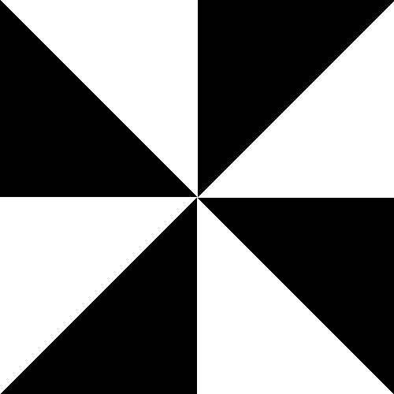
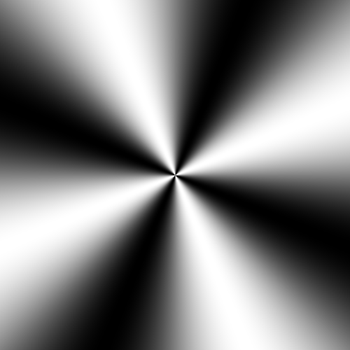
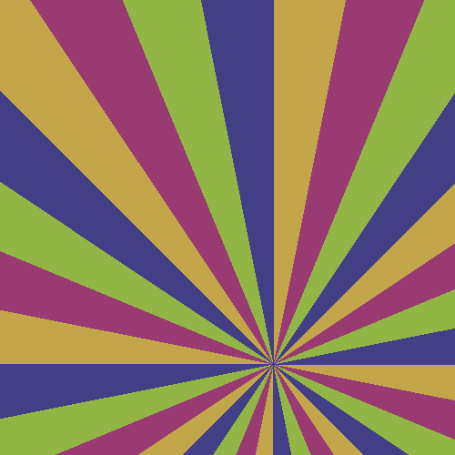

# Bowtie

This generates a bowtie to fill the given area, it consists of a number
of triangle segments that all converge on the centre of the image.

If the `"cwRotation"` field is set then the bowtie will
rotate per frame, this is calculated by the frame number
multiplied by the rotational angle. You do **not** need to
manually update the angle per frame.

It has the following required fields:

- `segmentCount` - the number of segments in the bowtie, it has a minimum
required count of 4.

It has the following optional fields:

- `segmentColors` - the colour of each segment, in the order you want the segments to be coloured.
The default colours are black and white.
The colours follow the [opoenTSG colour naming conventions](../utils/parameters/readme.md#colour)
- `startAngle` - the angle from the origin the bowtie starts from.
it follows the [angle unit rules](../utils/parameters/readme.md#clockwise-rotation)
- `cwRotation` - the clockwise angle for the zone plate to be to rotated,
it follows the [angle unit rules](../utils/parameters/readme.md#clockwise-rotation)
- `offset` - the offset of the origin of the bowtie, the default behaviour is to centre
the origin. All values follow the [offset unit rules](../utils/parameters/readme.md#offset)
It has the following fields:
  -`x` - The x offset of the origin. A positive x value moves the origin to the right.
  -`y` - The y offset of the origin. A positive y value moves the origin upwards.
- `blend` - the blend method for two neighbouring segments. The default behaviour is
to not blend the segments. It has the following values:
  - `"sin"` - blend the segments together as a sin curve of the difference
  between the angle of the two segments.

```json
{
    "cwRotation": "π*23/47",
    "grid": {
        "alias": " A demo alias",
        "location": "a1"
    },
    "blend":"sin",
    "segmentColors": [
        "#C2A649",
        "#9A3A73",
        "#91B645",
        "#433F87"
    ],
    "segmentCount": 32,
    "type": "builtin.bowtie",
    "offset": {
      "x":20,
      "y" : "-20px"
    }
}
```

Here are some further examples and their output:

- [8Segment-example.json](../exampleJson/builtin.bowtie/8Segment-example.json) This does



- [maximum.json](../exampleJson/builtin.bowtie/Sin8Segment-example.json)



- [maximum.json](../exampleJson/builtin.bowtie/offsetXAndY-example.json)


