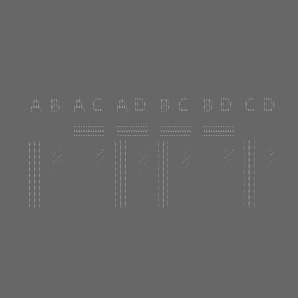

# EBU3733

EBU 3373 is a test pattern for testing HD Hybrid Log Gamma workflows,
for OpenTSG the individual segments of the test pattern have been separated
into widgets , so that you can use just the components you require.
More technical details of each segment
can be found [in the official specification.](https://tech.ebu.ch/publications/tech3373)

## Bars

The ebu3373 bars are generated to fill the space.
The bars are in 10 bit BT2020 colour space, and contain
colour used for testing conversions to
Rec 709.

It has no fields, only the location is required.

```json .valid
{
    "props": {
    "type": "builtin.ebu3373/bars",
      "location": {
        "alias" : "A demo Alias",
        "box": {
          "x": 1,
          "y": 1
        }
      }
    }
}
```

Here are some further examples and their output:

- [base.json](../exampleJson/builtin.ebu3373/bars/base-example.json)


## Luma

A horizontal luma ramp from the 10 bit value 4 to 1019,
is generated to fill the widget area. It is used for
checking linear mapping functions and for clipping
of lights and darks.

It has no fields, only the location is required.

```json
{
    "props": {
    "type": "builtin.ebu3373/luma",
      "location": {
        "alias" : "A demo Alias",
        "box": {
          "x": 1,
          "y": 1
        }
      }
    }
}
```

Here are some further examples and their output:

- [base.json](../exampleJson/builtin.ebu3373/luma/base-example.json)


## Near black

Alternating segments of 10 bit 0% black (RGB10(64,64,64)) and
-4%, -2%, -1%, 1%, 2%, 4% black. This is for checking
sub blacks are not removed in the production chain.

It has no fields, only the location is required.

```json
{
    "props": {
    "type": "builtin.ebu3373/nearblack",
      "location": {
        "alias" : "A demo Alias",
        "box": {
          "x": 1,
          "y": 1
        }
      }
    }
}
```

Here are some further examples and their output:

- [base.json](../exampleJson/builtin.ebu3373/nearblack/base-example.json)


## Saturation

The saturation generates the steps of red, green and blue
from minimum to maximum saturation. These saturations
are used to establish the colour space of the viewing device.

It has the following optional fields

- `colors` - An array of the "red", "green" and "blue". The saturation appears in the order
they were declared. If only one colour is chosen then only that colour is used. If `colors`
is not declared then the default order of, red,green and blue is used.

```json
{
    "props": {
    "type": "builtin.ebu3373/saturation",
      "location": {
        "alias" : "A demo Alias",
        "box": {
          "x": 1,
          "y": 1
        }
      }
    },
    "colors": [
        "red",
        "green",
        "blue"
    ]
}
```

Here are some further examples and their output:

- [minimum.json](../exampleJson/builtin.ebu3373/saturation/minimum-example.json)


- [maximum.json](../exampleJson/builtin.ebu3373/saturation/maximum-example.json)


- [different_order.json](../exampleJson/builtin.ebu3373/saturation/diff-example.json)


## Two SI

Two Si is the two sample interleave pattern, for when SMPTE ST 425-5:2019
is used. The order of the four 3G-SDI video cables can be checked.
It consists of 8 combos of the four ABCD cables and lines. Each letter and
set of lines are linked to a cable. If they don't match the expected
layout then the cables are not correctly ordered.

It has no fields, only the location is required.

```json
{
    "props": {
    "type": "builtin.ebu3373/twosi",
      "location": {
        "alias" : "A demo Alias",
        "box": {
          "x": 1,
          "y": 1
        }
      }
    }
}
```

Here are some further examples and their output:

- [base.json](../exampleJson/builtin.ebu3373/twosi/base-example.json)


