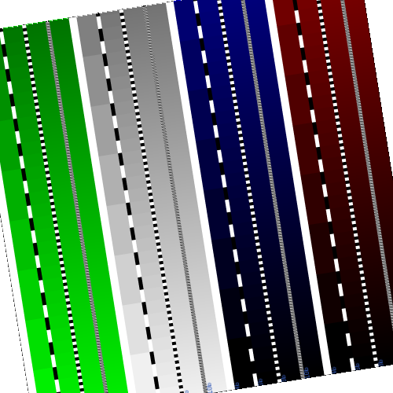
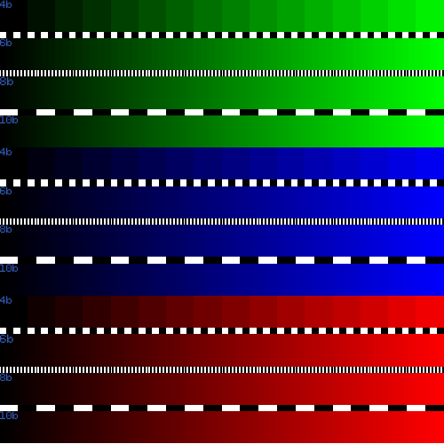
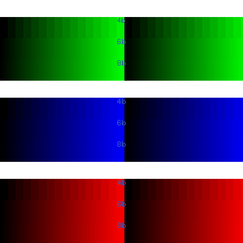
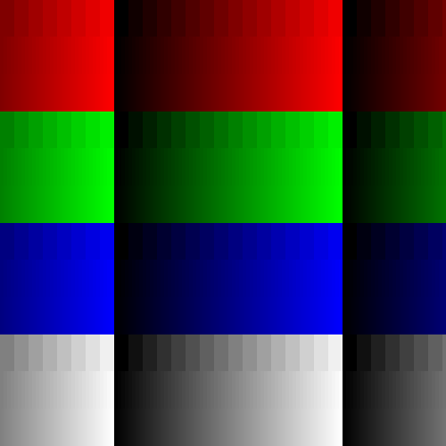

# Gradients

Gradients are for checking bit depths of a display, up to 16 bits.
Each gradient can have any bit depth between 1 and 16 (inclusive).

This creates a gradient with a colour shift based on the maximum
bit depth of all the gradients.
e.g. a 16 bit gradient will shift colour every pixel, a 15 bit every 2 pixels,
a 14 bit every 4 pixels etc.

The gradients are an array of bit depths and relative heights, the
order they are declared is the order they appear.
These gradients are organised into groups, where the colour, start value
and direction are defined. The gradients are the same in every group.
So when you design a gradient widget, you design the gradients first,
then the groups that use these gradients second.

If two alternate bit depths appear
to have the same shift then the bit depth limit of the display
may have been found. The total height of the ramps scales to the
area it is given.

Gradients has the following fields:

only the `color`/`colors` and `height` subfields are required
for a ramp to be drawn. Everything else is optional. The available
ramp colors are `red`, `green`, `blue`, `grey`. The dividers have
these colours as well as `black` and `white`.

- `Gradients` - contains the gradient information
  - `GroupSeparator` - the separator between the groups of gradients. This is the
first row in the group.
    - `height` - the relative height of the group separator.
    - `color` - the colour of the separator.
  - `GradientSeparator` - the separator between the gradients.
    - `height` - the relative height of the gradient separator.
    - `colors` - An array of colours to separate each group. If more than one colour
is used then they alternate at each bit shift of the gradient the row below.
  - `Gradients` - An array of the individual properties of each gradient.
the array order is the order of the gradients.
    - `height` - the relative height of the gradient.
    - `bitDepth` - the bitdepth of the gradient.
    - `label` - the label of the gradient ramp.
- `Groups` - the properties for a group of gradients.
  - `color` - the colour for the group of gradients.
  - `initialPixelValue` - the initial pixel value the gradients start on.
The default is 0.
  - `reverse` - if true the ramps go from high to low rather
than the default low to high.
- `WidgetProperties` - the base properties for the widgets.
  - `maxBitDepth`- the overall maximum bit depth of the gradient widget.
The default is 16
  - `cwRotation` - the clockwise rotation of the ramp.
it follows the [angle unit rules](../utils/parameters/readme.md#clockwise-rotation)
  - `objectFitFill` - if true the gradient will not be accurate
as values are shifted to fit the bit depth steps across the width the
gradient was given. Whereas the default behaviour does not change the
pixel step values.
  - `pixelValueRepeat` - the amount of times a bitdepth pixel range is
repeated. The default property is 1.
  - `TextProperties` - the text properties of the labels, these are applied to every gradient.
    - `textyPosition` - the text alignment in the y direction, it can be top, bottom or middle.
    - `textxPosition` - the text alignment in the x direction, it can be left, right or middle.
    - `textHeight` - the height if the text as a percentage of the ramp height.
    - `textColor` - the colour of the text.

All colour options in the `TextProperties` follow the [TSG colour formats](../utils/parameters/readme.md#colour)

An example json is given below.

```json
{
    "type" :  "builtin.gradients",
    "groupsTemplates": {
        "separator": {
            "height": 0,
            "color": "white"
        },
        "gradientSeparator": {
            "colors": [
                "white",
                "black",
                "red",
                "blue"
            ],
            "height": 1
        },
        "gradients": [
            {
                "height": 5,
                "bitDepth": 4,
                "label": "4b"
            },
            {
                "height": 5,
                "bitDepth": 6,
                "label": "6b"
            },
            {
                "height": 5,
                "bitDepth": 8,
                "label": "8b"
            },
            {
                "height": 5,
                "bitDepth": 10,
                "label": "10b"
            }
        ]
    },
    "groups": [
        {
            "color": "green",
            "initialPixelValue": 960,
            "reverse": false
        },
        {
            "color": "gray",
            "initialPixelValue": 960,
            "reverse": false
        }
    ],
    "widgetProperties": {
        "maxBitDepth": 10,
        "cwRotation": "",
        "objectFitFill": false,
        "pixelValueRepeat": 0,
        "textProperties": {
            "textyPosition": "top",
            "textxPosition": "left",
            "textHeight": 30,
            "textColor": "#345AB6"
        }
    },
    "grid": {
      "location": "a1",
      "alias" : "A demo Alias"
    }
}
```

Here are some further examples and their output:

- [minimum.json](../exampleJson/builtin.gradients/minimum-example.json)

This does
not generate an image as no fields are used. 0 or more fields can be used with
the `"textProperties"` field.

- [maximum.json](../exampleJson/builtin.gradients/maximum-example.json)



- [noGroupSeparator.json](../exampleJson/builtin.gradients/noGroupSeparator-example.json)



- [noGradientSeparator.json](../exampleJson/builtin.gradients/noGradientSeparator-example.json)



- [noText.json](../exampleJson/builtin.gradients/noText-example.json)


