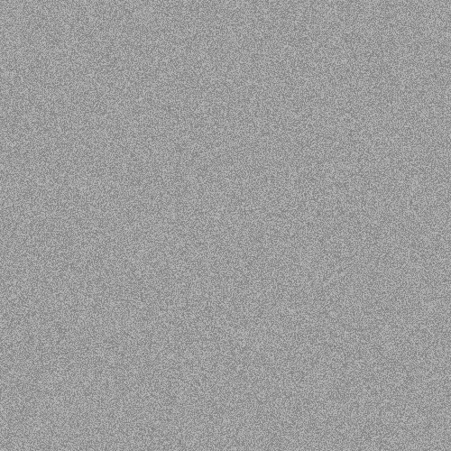

# Noise

Noise generates 12 bit white noise to fill the widget.

It has the following required fields:

- `noiseType` - the type of noise to be generated. Only
`"white noise"` is an accepted input.

It has the following optional fields

- `minimum` - the minimum 12 bit integer value for the white noise
- `maximum` - the maximum 12 bit integer value for the white noise
- `yOffset` - This is the offset in the y direction. All values are measured in pixels
It has the subfields:
  - `BottomLeft` - The offset from the bottom left corner
  - `BottomRight` - The offset from the bottom right corner
  - `TopLeft` - The offset from the top left corner
  - `TopRight`  - The offset from the top right corner

```json
{
    "type" :  "builtin.noise",
    "noiseType": "white noise",
    "minimum": 0,
    "maximum": 4095,
    "yOffset": {
        "bottomLeft": 0,
        "bottomRight": 50,
        "topLeft": 50,
        "topRight": 0
    },
    "grid": {
      "location": "a1",
      "alias" : "A demo Alias"
    }
}
```

Here are some further examples and their output:

- [minimum.json](../exampleJson/builtin.noise/minimum-example.json)


- [maximum.json](../exampleJson/builtin.noise/maximum-example.json)



- [rightGuillotine.json](../exampleJson/builtin.noise/rightGuillotine-example.json)


