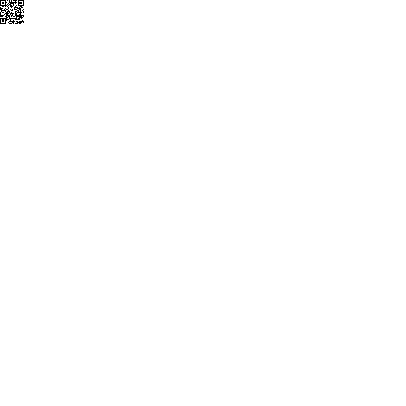
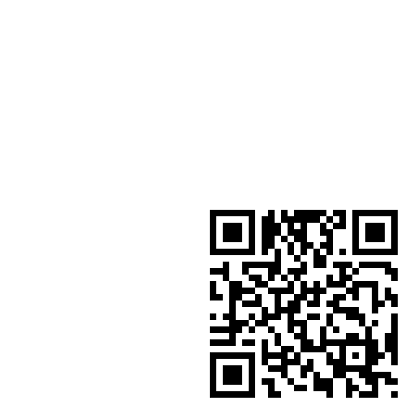

# qr gen

Generates a qr code from the user input.
It has the following required fields

- `code` - the text to be made into a qr code

It has the following optional fields:

- `offset` - the offset of the origin of the qrcode, the default behaviour is to centre
the origin. All values follow the [offset unit rules](../utils/parameters/readme.md#offset)
It has the following fields:
  -`x` - The x offset of the origin. A positive x value moves the origin to the right.
  -`y` - The y offset of the origin. A positive y value moves the origin upwards.
- `size` - the size of the qrcode, relative to its box.
It has the following fields:
  -`width` - The width of the qrcode, as a percentage of its box.
  -`height` - The height of the qrcode, as a percentage of its box.

```json
{
    "type" :  "builtin.qrcode",
    "code": "https://opentsg.studio/",
    "offset": {
        "x":0,
        "y": 0
    },
    "grid": {
      "location": "a1",
      "alias" : "A demo Alias"
    },
    "size": {
        "height": 50,
        "width": 50
    },
}
```

Here are some further examples and their output:

- [minimum.json](../exampleJson/builtin.qrcode/minimum-example.json)



- [maximum.json](../exampleJson/builtin.qrcode/maximum-example.json)


- [middle.json](../exampleJson/builtin.qrcode/middlepic-example.json)


