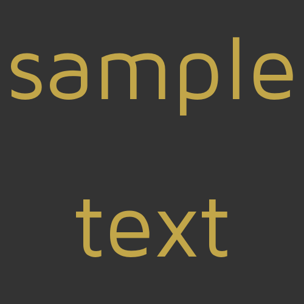

# Textbox

Generates a text box of one or more lines of text, with an optional border.
If a colour is not declared for the text, background or the border then that
component will not be generated. e.g. you can create blocks of colour by not
declaring a text or border colour.
It has the following optional fields:

- `text` - an array of strings, the font size is generated so the text fills the space, where multiple lines of
text are used. The smallest font of the multiple lines is used.
- `borderColor` - is the colour of the border
- `borderSize` - the size of the border as a percentage of the height or width (whichever is smaller).
The maximum value is 50 (%)
- `font` - the font to be used, it can be an in built font of `title`, `body`, `pixel` or `header`. Or it can also be
the path to a local file or web source.
- `backgroundColor` - the colour of the background.
- `textColor` - the colour of the text.
- `fillType` - the fill of the text in the textbox, it can be `full` or `relaxed`.
- `xAlignment` - the text alignment in the x direction, it can be `left`, `right` or `middle`.
- `yAlignment` - the text alignment in the y direction, it can be `top`, `bottom` or `middle`.

All colour options follow the [TSG colour formats](../utils/parameters/readme.md#colour)

```json
{
    "type" :  "builtin.textbox",
    "text": [
        "sample",
        "text"
    ],
    "borderColor": "#f0f0f0",
    "borderSize": 20,
    "font": "",
    "backgroundColor": "#ffffff",
    "textColor": "#C2A649",
    "fillType": "",
    "xAlignment": "",
    "yAlignment": "middle",
    "grid": {
      "location": "a1",
      "alias" : "A demo Alias"
    }
}
```

Here are some further examples and their output:

- [minimum.json](../exampleJson/builtin.textbox/minimum-example.json) This does
not generate an image as no fields are used. 0 or more fields can be used with
the textbox widget.

- [maximum.json](../exampleJson/builtin.textbox/maximum-example.json)


- [noborder.json](../exampleJson/builtin.textbox/noborder-example.json)



- [notext.json](../exampleJson/builtin.textbox/notext-example.json)


