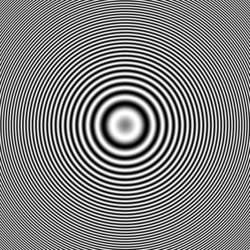
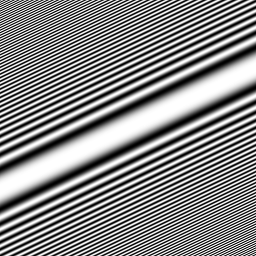
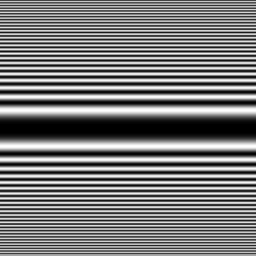

# Zoneplate

This generates a [zone plate](https://en.wikipedia.org/wiki/Zone_plate) to fill the given area.

It has the following required fields:

- `plateType` - the type and shape of zone plate these are `circular`, `sweep`, `ellipse`, `horizontalSweep` or `verticalSweep`.
The default option is `circular`.

It has the following optional fields:

- `startColor` -  the start colour of the zone plate, these are `white`, `black`, `grey` or `gray`.
- `waveType` -  the formula for calculating the zone plate, the default is `zonePlate`
the options are `sin`, `cos` or`zonePlate`
- `cwRotation` - the clockwise angle for the zone plate to be to rotated,
it follows the [angle unit rules](../utils/parameters/readme.md#clockwise-rotation)
- `frequency` - the frequency of the zone plate, it is capped at π. The default is value `0.8*π`
it follows the [angle unit rules](../utils/parameters/readme.md#clockwise-rotation)

```json
{
    "type" :  "builtin.zoneplate",
    "plateType": "sweep",
    "startColor": "white",
    "cwRotation": "π*1",
    "grid": {
      "location": "a1",
      "alias" : "A demo Alias"
    },
    "frequency": "π*13/100",
}
```

Here are some further examples and their output:

- [minimum.json](../exampleJson/builtin.zoneplate/minimum-example.json) This does



- [maximum.json](../exampleJson/builtin.zoneplate/maximum-example.json)



- [norotation.json](../exampleJson/builtin.zoneplate/noangle-example.json)


